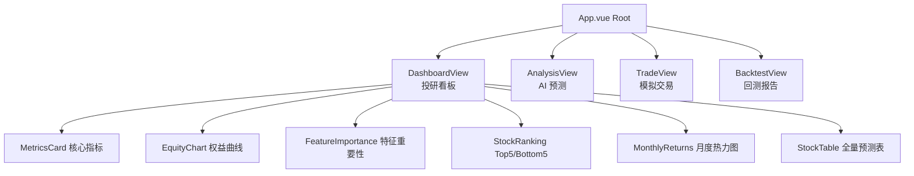

# AlphaTransformer 量化智能投研平台 - 项目架构文档

> **版本**: 1.0.0
> **最后更新**: 2026-03-27
> **用途**: 本文档旨在为 AI 开发助手提供项目的全局规范和架构概览，确保每次新的会话都能快速理解项目并高效工作。

---

## 1. 项目概览

### 1.1 项目简介

**AlphaTransformer** 是一个基于 Vue 3 + TypeScript 的量化智能投研平台前端应用，专注于股票市场的 AI 预测与模拟交易。

**核心能力**：
- AI 驱动的股票评分与信号生成
- 多维度量化策略回测与绩效评估
- 模拟交易执行（手动 + AI 自动托管）
- 实时权益曲线与风险监控

### 1.2 技术栈总览

| 层级 | 技术选型 | 用途说明 |
|------|----------|----------|
| **框架** | Vue 3.5 (Composition API) | 前端 UI 框架，采用 `<script setup>` 语法糖 |
| **类型系统** | TypeScript 5.6 | 类型安全，开启严格模式 (`strict: true`) |
| **构建工具** | Vite 5 | 极速开发服务器与生产构建 |
| **状态管理** | Pinia 2.2 | Vue 3 官方推荐的状态管理方案 |
| **UI 库** | Element Plus 2.8 | 企业级 Vue 3 组件库 |
| **图表库** | Apache ECharts 5.5 | K线图、权益曲线、特征重要性等数据可视化 |
| **HTTP 客户端** | Axios 1.7 | API 请求管理（带拦截器与请求取消） |
| **实时通信** | 原生 WebSocket | 推理日志流推送 |
| **样式预处理器** | SCSS | 使用 CSS 变量、嵌套、混合器 |
| **路由管理** | Vue Router 4.6 | SPA 页面导航 |
| **图标库** | @element-plus/icons-vue | Element Plus 官方图标库 |

### 1.3 环境要求

```bash
# Node.js 版本
node >= 18.0.0
npm >= 9.0.0
pnpm >= 8.0.0  # 推荐使用 pnpm
```

---

## 2. 目录结构

```
Stock Forecast/frontend/           # 主要前端项目目录
├── src/
│   ├── api/                      # API 客户端层（核心网络逻辑）
│   │   ├── index.ts              # ⚠️ 核心：APIClient 单例 + WebSocket LogStream
│   │   ├── base.ts               # 基础 axios 实例（被 index.ts 引用）
│   │   └── trading.ts            # 交易模块专用 API 函数
│   │
│   ├── assets/                   # 静态资源（图片、字体等）
│   │
│   ├── components/               # 可复用 UI 组件
│   │   ├── charts/               # ECharts 图表组件
│   │   │   ├── AIGauge.vue       # AI 评分仪表盘（半圆仪表）
│   │   │   ├── EquityChart.vue   # 权益曲线图（策略 vs 基准对比）
│   │   │   ├── FeatureImportance.vue  # 特征重要性柱状图
│   │   │   ├── KLineChart.vue     # K线蜡烛图组件
│   │   │   └── StockRanking.vue   # 股票排行榜
│   │   │
│   │   ├── trade/                # 交易模块专用组件
│   │   │   ├── AITradingDrawer.vue  # AI 自动托管配置抽屉
│   │   │   ├── AccountBoard.vue    # 账户信息面板
│   │   │   ├── PositionList.vue    # 当前持仓列表
│   │   │   └── TradePanel.vue      # 手动下单操作面板
│   │   │
│   │   ├── DetailPanel.vue       # 权益曲线钻取详情面板
│   │   ├── FeatureImportance.vue # 特征重要性展示
│   │   ├── LogDrawer.vue         # 推理日志抽屉
│   │   ├── MetricsCard.vue       # 核心指标卡片（年化收益、夏普等）
│   │   ├── SkeletonScreen.vue    # 初始加载骨架屏
│   │   └── StockTable.vue        # 全量股票预测表格（支持排序）
│   │
│   ├── stores/                   # Pinia 状态管理
│   │   ├── dashboard.ts          # 仪表盘状态（指标、权益曲线、预测数据）
│   │   └── trading.ts            # 交易状态（账户、持仓、AI 自动交易）
│   │
│   ├── styles/                   # 全局样式
│   │   └── BloombergTheme.css     # 彭博终端深色主题（CSS 变量定义）
│   │
│   ├── types/                    # TypeScript 类型定义
│   │   └── index.ts              # API 接口、全局类型声明
│   │
│   ├── views/                    # 页面级组件（路由视图）
│   │   ├── DashboardView.vue    # 投研看板（核心首页）
│   │   ├── AnalysisView.vue      # AI 智能预测（K线分析页面）
│   │   ├── TradeView.vue         # 模拟交易（手动/自动下单）
│   │   └── BacktestView.vue       # 回测报告页面
│   │
│   ├── router/
│   │   └── index.ts             # Vue Router 配置（路由守卫、标题管理）
│   │
│   ├── App.vue                  # 根组件（整体布局骨架、Header、Footer、弹窗挂载）
│   └── main.ts                 # 应用入口（Pinia、Router、Element Plus 初始化）
│
├── public/                      # 静态公共资源（favicon、robots.txt 等）
├── index.html                   # HTML 入口文件
├── vite.config.ts               # Vite 构建配置
├── tsconfig.json               # TypeScript 编译配置
├── package.json                # 依赖管理
└── README.md                   # 项目说明文档
```

---

## 3. 入口与路由体系

### 3.1 应用启动入口 (`main.ts`)

应用的初始化顺序非常重要，必须严格遵循以下顺序：

```typescript
// main.ts
import { createApp } from 'vue'
import { createPinia } from 'pinia'      // 1. 先创建 Pinia 实例
import ElementPlus from 'element-plus'
import 'element-plus/dist/index.css'
import * as ElementPlusIconsVue from '@element-plus/icons-vue'
import App from './App.vue'
import router from './router'             // 2. 再加载 Router（Router 依赖 Pinia）

const app = createApp(App)

app.use(createPinia())                   // 3. 注册 Pinia
app.use(router)                          // 4. 注册 Router
app.use(ElementPlus)                     // 5. 注册 Element Plus

// 全局注册所有 Element Plus 图标
for (const [key, component] of Object.entries(ElementPlusIconsVue)) {
  app.component(key, component)
}

app.mount('#app')                        // 6. 最后挂载根组件
```

### 3.2 路由配置 (`router/index.ts`)

项目定义了 4 个核心路由，对应 4 个主要页面：

```typescript
import { createRouter, createWebHistory, type RouteRecordRaw } from 'vue-router'

// 页面组件导入
import DashboardView from '@/views/DashboardView.vue'
import AnalysisView from '@/views/AnalysisView.vue'
import TradeView from '@/views/TradeView.vue'
import BacktestView from '@/views/BacktestView.vue'

const routes: RouteRecordRaw[] = [
  {
    path: '/',
    name: 'dashboard',
    component: DashboardView,
    meta: { title: '投研看板' },
  },
  {
    path: '/analysis',
    name: 'analysis',
    component: AnalysisView,
    meta: { title: 'AI 智能预测' },
  },
  {
    path: '/trade',
    name: 'trade',
    component: TradeView,
    meta: { title: '模拟交易' },
  },
  {
    path: '/backtest',
    name: 'backtest',
    component: BacktestView,
    meta: { title: '回测报告' },
  },
]

const router = createRouter({
  history: createWebHistory(import.meta.env.BASE_URL),
  routes,
})

// 路由守卫：自动更新页面标题
router.beforeEach((to, _from, next) => {
  document.title = `${to.meta.title || 'AlphaTransformer'} - 量化智能投研平台`
  next()
})

export default router
```

### 3.3 页面结构概览



### 3.4 如何添加新页面

1. **创建视图组件**：在 `src/views/` 目录下创建 `.vue` 文件（如 `NewPageView.vue`）
2. **导入并注册路由**：在 `src/router/index.ts` 中添加路由配置
3. **在 App.vue 中添加导航链接**：在 `<nav class="tab-nav">` 中添加 `<router-link>`

---

## 4. API 调用规范

### 4.1 核心 API Client

项目使用 `APIClient` 单例封装 Axios，提供了**请求取消**、**全局错误处理**和**响应自动解包**等能力。

**核心特性**：
- `GET` / `POST` 方法支持请求取消（防止快速切换时数据覆盖）
- 全局响应拦截器，自动提取 `response.data`
- 统一的错误处理 + Element Plus 消息通知
- WebSocket 推理日志流（`LogStream` 类）

### 4.2 基本使用方式

```typescript
import { apiClient } from '@/api'

// GET 请求
const data = await apiClient.get<MyResponseType>('/endpoint/path')

// GET 请求（带请求取消 key - 快速切换时自动取消旧请求）
const forecast = await apiClient.get<ForecastResponse>(`/forecast/${ticker}`, `forecast-${ticker}`)

// POST 请求
const result = await apiClient.post<ResultType>('/endpoint/path', { key: 'value' })

// 取消指定 key 的请求
apiClient.cancelKey('forecast-AAPL')
```

### 4.3 API 函数编写模板

每个模块应维护自己的 API 函数文件（如 `trading.ts`）。模板如下：

```typescript
// src/api/newModule.ts
import { apiClient } from '@/api/base'  // 注意：实际使用 @/api/base

// ── 类型定义 ──────────────────────────────────────────────────────────────
export interface MyResponse {
  field1: string
  field2: number
}

// ── API 函数 ───────────────────────────────────────────────────────────────
export const fetchMyData = () =>
  apiClient.get<MyResponse>('/endpoint/my-data')

export const postMyAction = (body: { param: string }) =>
  apiClient.post<{ status: string }>('/endpoint/action', body)
```

### 4.4 请求取消机制说明

当用户快速切换股票（如 AAPL → TSLA → GOOGL）时，如果不取消旧请求，可能导致数据覆盖问题。解决方案：

```typescript
// 在 watch 中使用请求取消 key
watch(selectedTicker, (ticker) => {
  // key='forecast' 确保每次只会有一笔 "forecast" 请求在飞
  // 新请求会自动取消旧请求
  fetch(`/forecast/${ticker}`, 'forecast')
})
```

### 4.5 WebSocket 日志流

```typescript
import { logStream } from '@/api'

// 连接日志流
logStream.connect()

// 监听日志消息
const unsubscribe = logStream.onMessage((entry) => {
  console.log(`[${entry.level}] ${entry.message}`)
})

// 断开连接（组件卸载时）
onUnmounted(() => {
  unsubscribe()
  logStream.disconnect()
})
```

---

## 5. 状态管理规范

### 5.1 Pinia Store 组织方式

项目使用 Pinia 的 **Composition API 风格**（`defineStore` + 函数式），推荐在 `stores/` 目录下按功能模块拆分。

**模板**：

```typescript
// src/stores/myStore.ts
import { defineStore } from 'pinia'
import { ref, computed } from 'vue'
import { fetchMyData } from '@/api/myModule'

export const useMyStore = defineStore('myStore', () => {
  // ── State ─────────────────────────────────────────────────────────────
  const myData = ref<MyData | null>(null)
  const isLoading = ref(false)
  const error = ref<string | null>(null)

  // ── Computed ─────────────────────────────────────────────────────────
  const isEmpty = computed(() => !myData.value)

  // ── Actions ───────────────────────────────────────────────────────────
  async function loadData() {
    isLoading.value = true
    error.value = null
    try {
      myData.value = await fetchMyData()
    } catch (e) {
      error.value = e instanceof Error ? e.message : '加载失败'
    } finally {
      isLoading.value = false
    }
  }

  // ── Return ────────────────────────────────────────────────────────────
  return {
    myData,
    isLoading,
    error,
    isEmpty,
    loadData,
  }
})
```

### 5.2 Store 使用方式

```typescript
import { useMyStore } from '@/stores/myStore'

// 在组件中使用
const store = useMyStore()

// 访问 state
console.log(store.myData)

// 调用 action
await store.loadData()

// 使用 storeToRefs 保持响应性（解构时必须使用）
import { storeToRefs } from 'pinia'
const { myData, isLoading } = storeToRefs(store)
```

### 5.3 现有 Store 概览

| Store | 文件 | 职责范围 |
|-------|------|----------|
| `useDashboardStore` | `stores/dashboard.ts` | 投研看板数据（指标、权益曲线、预测、模型状态） |
| `useTradingStore` | `stores/trading.ts` | 模拟交易（账户余额、持仓、交易历史、AI 自动交易） |

---

## 6. 组件开发规范

### 6.1 组件拆分原则

遵循**单一职责原则**，按粒度由大到小拆分：

```
views/          # 页面级组件（路由视图，组合多个业务模块）
components/     # 业务组件（可复用的 UI 块）
  ├── charts/   # 纯图表组件（封装 ECharts 配置）
  ├── trade/    # 交易业务组件
components/     # 通用组件
```

### 6.2 Vue 组件模板

```vue
<template>
  <div class="my-component">
    <!-- 模板内容 -->
  </div>
</template>

<script setup lang="ts">
import { ref, computed, onMounted } from 'vue'
import { useMyStore } from '@/stores/myStore'

// Props 定义（使用 withDefaults 提供默认值）
interface Props {
  title: string
  maxItems?: number
}
const props = withDefaults(defineProps<Props>(), {
  title: '默认标题',
  maxItems: 10,
})

// Emit 定义
const emit = defineEmits<{
  (e: 'item-click', id: string): void
  (e: 'update:visible', value: boolean): void
}>()

// Composables / Store
const store = useMyStore()

// 业务逻辑...

function handleClick(id: string) {
  emit('item-click', id)
}
</script>

<style scoped>
.my-component {
  /* 作用域样式 */
}
</style>
```

### 6.3 Props 与 Events 类型规范

- **Props**：使用 TypeScript 接口 + `withDefaults` 定义，默认值在 `withDefaults` 中设置
- **Events**：使用 `defineEmits` 泛型定义事件签名

---

## 7. 样式与主题系统

### 7.1 Bloomberg 主题变量

项目的视觉风格定义在 `src/styles/BloombergTheme.css`（或 `.scss`），采用 CSS 变量（Custom Properties）实现主题管理。

**核心变量**：

```css
/* ── 背景层级 ─────────────────────────────────────────────────────────── */
--bg-primary: #0a0e1a;      /* 最深层背景（页面背景） */
--bg-secondary: #111827;     /* 卡片/面板背景 */
--bg-card: #1a2332;          /* 内层卡片背景 */
--bg-hover: #232d3f;         /* 悬停状态背景 */
--bg-active: #2a3547;        /* 激活/选中背景 */

/* ── 边框 ─────────────────────────────────────────────────────────────── */
--border-default: #1f2937;   /* 默认边框 */
--border-hover: #374151;     /* 悬停边框 */

/* ── 文字颜色 ─────────────────────────────────────────────────────────── */
--text-primary: #f9fafb;     /* 主要文字 */
--text-secondary: #9ca3af;   /* 次要文字 */
--text-muted: #4b5563;       /* 弱化文字 */

/* ── A股惯例涨跌颜色（红涨绿跌）────────────────────────────────────────── */
--color-up: #f56c6c;         /* 上涨/盈利（红色） */
--color-down: #67c23a;       /* 下跌/亏损（绿色） */

/* ── 强调色 ───────────────────────────────────────────────────────────── */
--accent-primary: #677ef1;   /* 主强调色（紫色，用于按钮、链接） */
--accent-gold: #f5a623;      /* 金色强调 */
--accent-blue: #8ba4f7;      /* 蓝色 */

/* ── 功能色 ───────────────────────────────────────────────────────────── */
--color-success: #67c23a;
--color-warning: #f5a623;
--color-danger: #f56c6c;
--color-info: #8ba4f7;

/* ── 字体 ─────────────────────────────────────────────────────────────── */
--font-sans: 'Inter', -apple-system, BlinkMacSystemFont, 'Segoe UI', sans-serif;
--font-mono: 'JetBrains Mono', 'Courier New', monospace;

/* ── 圆角 ─────────────────────────────────────────────────────────────── */
--radius-sm: 4px;
--radius-md: 8px;
--radius-lg: 12px;
```

### 7.2 颜色使用规范

**⚠️ A股惯例**：本项目遵循中国A股市场的 **红涨绿跌** 颜色规范，与美股/国际惯例相反。

| 场景 | 颜色变量 | 色值 | 说明 |
|------|----------|------|------|
| 上涨/盈利/看多 | `--color-up` | `#f56c6c` | 红色 |
| 下跌/亏损/看空 | `--color-down` | `#67c23a` | 绿色 |

```vue
<template>
  <!-- 正确示例 -->
  <span :class="pnl >= 0 ? 'text-up' : 'text-down'">{{ pnl }}</span>
</template>

<style scoped>
.text-up { color: var(--color-up); }
.text-down { color: var(--color-down); }
</style>
```

### 7.3 响应式断点

```scss
// 断点定义
$breakpoint-sm: 640px;   // 手机竖屏
$breakpoint-md: 768px;   // 手机横屏 / 小平板
$breakpoint-lg: 1024px;  // 平板 / 小桌面
$breakpoint-xl: 1280px;  // 桌面
$breakpoint-2xl: 1536px; // 大屏

// Grid 响应式示例
.metrics-grid {
  display: grid;
  grid-template-columns: repeat(7, 1fr); // 默认 7 列
  
  @media (max-width: 1200px) {
    grid-template-columns: repeat(4, 1fr); // 大屏以下 4 列
  }
  
  @media (max-width: 768px) {
    grid-template-columns: repeat(2, 1fr); // 平板以下 2 列
  }
}
```

---

## 8. 开发规范与工作流

### 8.1 环境变量

项目使用 Vite 的环境变量机制。根目录下的文件：

| 文件 | 用途 |
|------|------|
| `.env` | 所有环境通用变量 |
| `.env.development` | 开发环境专用 |
| `.env.production` | 生产环境专用 |
| `.env.local` | 本地覆盖（不提交到 Git） |

**变量命名规范**：`VITE_` 前缀

```bash
# .env.development
VITE_API_BASE_URL=http://localhost:8000/api/v1
VITE_WS_URL=ws://localhost:8000
```

### 8.2 调试与日志

- **前端日志**：使用 `console.log` / `console.error`，生产环境自动剥离
- **API 错误**：由 Axios 拦截器统一处理，弹出 Element Plus `ElMessage` 通知
- **推理日志**：通过 WebSocket `logStream` 实时展示在 `LogDrawer` 组件中

### 8.3 常用命令

```bash
# 安装依赖
pnpm install

# 开发模式启动
pnpm dev

# 生产构建
pnpm build

# 预览生产构建
pnpm preview

# TypeScript 类型检查
pnpm type-check  # 或 vue-tsc --noEmit
```

### 8.4 后端 API 约定

前端假设后端 API 遵循 RESTful 规范，基础路径为 `/api/v1`。

**核心 API 端点**：

| 模块 | 端点 | 方法 | 说明 |
|------|------|------|------|
| 看板 | `/dashboard/full` | GET | 获取完整看板数据 |
| 看板 | `/dashboard/metrics` | GET | 获取核心指标 |
| 看板 | `/dashboard/equity-curve` | GET | 获取权益曲线 |
| 看板 | `/dashboard/feature-importance` | GET | 获取特征重要性 |
| 看板 | `/dashboard/predictions` | GET | 获取全量预测 |
| 预测 | `/forecast/{ticker}` | GET | 获取单只股票 K 线 + 预测 |
| 账户 | `/account/balance` | GET | 获取账户余额 |
| 账户 | `/account/config` | POST | 配置账户参数 |
| 账户 | `/account/reset` | POST | 重置账户 |
| 持仓 | `/positions` | GET | 获取当前持仓 |
| 交易 | `/trade/manual` | POST | 手动下单 |
| 交易 | `/trade/close-position` | POST | 平仓 |
| 交易 | `/trade/history` | GET | 获取交易历史 |
| 自动交易 | `/auto-trading/status` | GET | 获取自动交易状态 |
| 自动交易 | `/auto-trading/start` | POST | 启动自动交易 |
| 自动交易 | `/auto-trading/stop` | POST | 停止自动交易 |
| 系统 | `/health` | GET | 健康检查 |

### 8.5 代码风格检查

项目使用 Vite 脚手架的默认配置。建议安装以下 IDE 插件：

- **VSCode / Cursor**：Volar (Vue 3 官方插件)、ESLint、Vite
- **格式化**：Prettier（项目根目录配置 `.prettierrc`）

---

## 9. 类型定义规范

所有 API 类型定义集中在 `src/types/index.ts` 和各 API 文件中。

```typescript
// src/types/index.ts

// ── Dashboard ──────────────────────────────────────────────────────────────
export interface DashboardMetrics {
  annual_return: number
  sharpe_ratio: number
  max_drawdown: number
}

export interface EquityPoint {
  date: string
  strategy: number
  benchmark: number
}

export interface FeatureImportanceItem {
  feature: string
  importance: number
}

// ── Trading ────────────────────────────────────────────────────────────────
export interface PositionItem {
  ticker: string
  quantity: number
  entry_price: number
  current_price: number
  market_value: number
  unrealized_pnl: number
  unrealized_pnl_pct: number
  // ... 其他字段
}

// ── Prediction ─────────────────────────────────────────────────────────────
export interface PredictionItem {
  ticker: string
  rank: number
  score: number
  direction: 'bullish' | 'bearish' | 'neutral'
  conf_pct: number
  top_features: string[]
}
```

---

## 10. 常见问题与解决方案

### Q1: 如何添加新的 API 端点？

1. 在 `src/api/index.ts` 或新建 `src/api/myModule.ts`
2. 定义类型接口
3. 使用 `apiClient.get()` / `apiClient.post()` 封装函数
4. 导出并在 Store 或组件中调用

### Q2: 如何添加新的状态管理？

1. 在 `src/stores/` 下创建 `myNewStore.ts`
2. 使用 `defineStore` 定义 Store
3. 在组件中通过 `useMyNewStore()` 调用

### Q3: 如何添加新的图表组件？

1. 在 `src/components/charts/` 下创建 `NewChart.vue`
2. 封装 ECharts 配置（参考 `EquityChart.vue`）
3. 在父组件中引入并传入数据

### Q4: 如何修改主题颜色？

编辑 `src/styles/BloombergTheme.css` 中的 CSS 变量。修改后全局生效。

### Q5: 前后端联调时遇到 CORS 问题？

后端需要配置 CORS 允许前端 origin（通常是 `http://localhost:5173` 开发模式）。

---

## 附录

### A. 文件命名规范

| 类型 | 规范 | 示例 |
|------|------|------|
| Vue 组件 | PascalCase | `DashboardView.vue`, `EquityChart.vue` |
| TypeScript 文件 | camelCase | `dashboardStore.ts`, `apiClient.ts` |
| 样式文件 | kebab-case | `bloomberg-theme.css` |
| 目录 | kebab-case | `src/components/trade/` |

### B. 关键文件速查

| 文件 | 职责 |
|------|------|
| `src/api/index.ts` | 核心 HTTP 客户端 + WebSocket |
| `src/stores/dashboard.ts` | 看板全局状态 |
| `src/stores/trading.ts` | 交易全局状态 |
| `src/styles/BloombergTheme.css` | 全局样式主题变量 |
| `src/router/index.ts` | 路由配置 |
| `vite.config.ts` | 构建配置 |
| `tsconfig.json` | TypeScript 配置 |

### C. 相关文档链接

- [Vue 3 官方文档](https://vuejs.org/)
- [Pinia 文档](https://pinia.vuejs.org/)
- [Element Plus 文档](https://element-plus.org/)
- [ECharts 文档](https://echarts.apache.org/)
- [Vue Router 4 文档](https://router.vuejs.org/)
- [Vite 文档](https://vitejs.dev/)

---

*本文档由 AI 助手自动生成并维护。如有更新，请同步修改此文件。*
